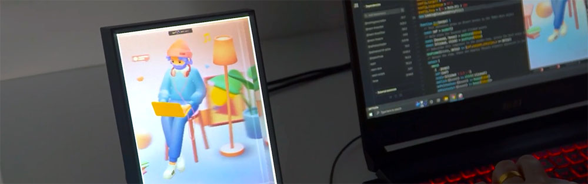

# Looking Glass WebXR Library



The Looking Glass WebXR Library provides a WebXR API for targeting [Looking Glass displays](https://lookingglassfactory.com/), this means that any 3D web framework that supports WebXR will work with the Looking Glass WebXR library. Ready to turn the internet holographic? Let's have some fun!

Looking Glass WebXR works in Chromium based browsers and Firefox, though we recommend chrome-based browsers for best performance.
Safari is not currently supported.

We've tested our WebXR Library with the following WebGL frameworks. If you use one and don't see it here, reach out on discord! We'd love to support as many as possible, it's likely yours may work too! 
- Three.JS (`v141+`) 
- Babylon.JS (`v5.0+`)
- PlayCanvas

## Requirements
In order to use WebXR:
- Plug in your [Looking Glass display](https://lookingglassfactory.com/) to your computer
- [Install Looking Glass Bridge](https://lookingglassfactory.com/software/looking-glass-bridge) and make sure it's currently running.
## Demos
We put together some documentation and demos for [three.js](https://docs.lookingglassfactory.com/developer-tools/webxr/three.js), [react-three-fiber](https://docs.lookingglassfactory.com/developer-tools/webxr/react-three-fiber), and [Spline](https://docs.lookingglassfactory.com/developer-tools/webxr/spline). Check them out!

### How it works
The `LookingGlassWebXRPolyfill` implements the WebXR override and allows you to target Looking Glass displays.

To view a WebXR project on your Looking Glass, visit one of the demos and then click the `Enter Looking Glass` button. This will open up a small pop-up window. 
Drag this window over to your Looking Glass display and then double click to have the hologram display properly. 

*Note:* On MacOS systems you must have Chrome or Firefox be in windowed mode, and not running in Fullscreen. Running in full screen will cause the window to open in a new tab instead of a new window. 

## Installation


### Using NPM/Yarn
You can import the Looking Glass WebXR library by running the following command in your web project.

```sh
npm install @lookingglass/webxr
```
or, if you use the yarn package manager. 
```sh
yarn install @lookingglass/webxr
```
### Import the library

To get started import `LookingGlassWebXRPolyfill`
```ts
import { LookingGlassWebXRPolyfill } from "@lookingglass/webxr"
```
or you can also use a `<script>` tag: 

```html
<script type="module">
  import { LookingGlassWebXRPolyfill } from "https://unpkg.com/@lookingglass/webxr@0.3.0/dist/@lookingglass/bundle/webxr.js"
</script>
```

## Initialize LookingGlassWebXRPolyfill

After you have the library properly installed and imported into your project, all you have to do is is instantiate `LookingGlassWebXRPolyfill` and you're done!

```ts
import { LookingGlassWebXRPolyfill } from "@lookingglass/webxr"

new LookingGlassWebXRPolyfill()
```

You should now see an "Enter Looking Glass" button in your scene. You can optionally pass in your own defaults for all the view controls:
```ts
new LookingGlassWebXRPolyfill({
  tileHeight: 512,
  numViews: 45,
  targetY: 0,
  targetZ: 0,
  targetDiam: 3,
  fovy: (14 * Math.PI) / 180
})
```

Since Looking Glass WebXR is engine agnostic there are a few settings that will be the same regardless of what 3D engine you're working with. Here are all the possible properties you can pass into `LookingGlassWebXRPolyfill`:

- `tileHeight` - defines the height of the individual quilt view, the width is then set based on the aspect ratio of the connected device.
- `numViews`   - defines the number of views to be rendered
- `targetX`    - defines the position of the camera on the X-axis
- `targetY`    - defines the position of the camera on the Y-axis
- `targetZ`    - defines the position of the camera on the Z-axis
- `trackballX` - defines the rotation of the camera on the X-axis
- `trackballY` - defines the rotation of the camera on the Y-axis
- `targetDiam` - defines the size of the camera, this makes your scene bigger or smaller without changing the focus.
- `fovy`       - defines the vertical FOV of your camera (defined in radians)
- `depthiness` - modifies to the view frustum to increase or decrease the perceived depth of the scene.
- `inlineView` - changes how the original canvas on your main web page is displayed, can show the encoded subpixel matrix, a single centered view, or a quilt view.

## Updating the view

In some cases you may need to update the view controls after instatiating:

```ts
const lookingGlassWebXR = new LookingGlassWebXRPolyfill({
  tileHeight: 512,
  numViews: 45,
  targetY: 0,
  targetZ: 0,
  targetDiam: 3,
  fovy: (14 * Math.PI) / 180
})

// ...

// Use the update() method
lookingGlassWebXR.update({
  numViews: 80
})
```
You can also update the config values by importing `LookingGlassConfig` and declaring it as follows, this can be handy if you want to modify the camera from a separate file where you're declaring the polyfill in.
```
 let config = LookingGlassConfig
 config.trackballX = Math.PI / 2
```

## Contributing
The Looking Glass WebXR Library is open source and originally developed by [Kai Ninomiya](https://kai.graphics). We're excited to support the open-source community! If you'd like to contribute, please feel free to make a pull request. 
